## [Table of Contents](#table-of-contents)
* [Purpose](#purpose)
* [Battlesphip Website](#battleship-website) 
* [User stories](#user-stories)
    * [First Time Visitor Goals](#first-time-visitor-goals)
    * [Returning Visitor Goals](#returning-visitor-goals)
* [Flowchart](#flowchart)   
* [Features](#features)
* [Validation](#validation)
* [Libraries and Modules Used](#libraries-and-modules-used)    
* [Technologies](#technologies)
* [Testing](#testing)
  * [Manual Testing](#manual-testing)
  * [Bugs](#bugs)
* [Deployment](#deployment)
* [Future featues](#future-features)
* [Credits](#credits)
   * [Code and Tutorials](#code-and-tutorials)
* [Acknoledgements](#acknowledgements)   
    
# BATTLESHIP GAME
## PURPOSE:
### GOAL and TARGET AUDIENCE:
#### To produce a game that will provide the user with the oppotunity to show their competitive instinticts whilst not actually having to compete agaienst another individual.
#### This is primarily a game of chance but also skill for after time you may be able to predict your opponents choice.
#### This is a game of chance, the player againest the computer.

* [Back to contents](#table-of-contents)

The live website can be found [here](https://project3-python-battleship.herokuapp.com/).

## Battleship Website

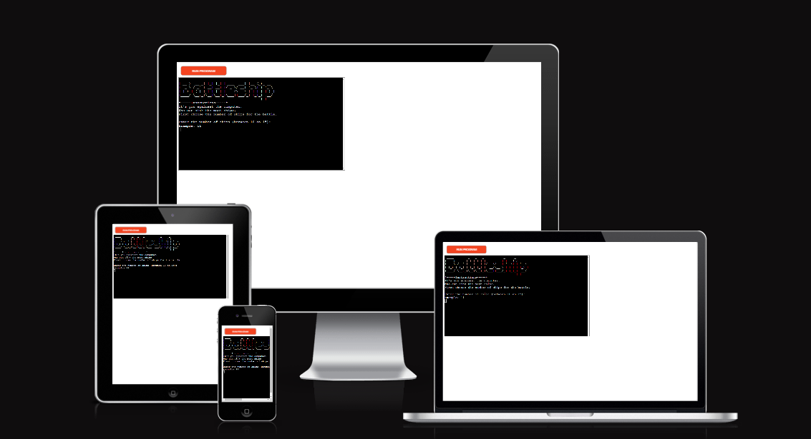

* [Back to contents](#table-of-contents)
*** 

## User stories

#### First Time Visitor Goals
* As a First Time user, I want to easily understand the main purpose of the site.
* As a first time user, I want to be able to play the game and participate in the experience.
* As a First Time user, I want to view the website and content clearly all devices.
* As a first time user, I want to know when I have make an incorrect input.
#### Returning Visitor Goals
* As a Returning user, I want to be able to begin the game quickly.
* As a Frequent user, I want to check to see if there are any changes.

* [Back to contents](#table-of-contents)
***

## Flowchart

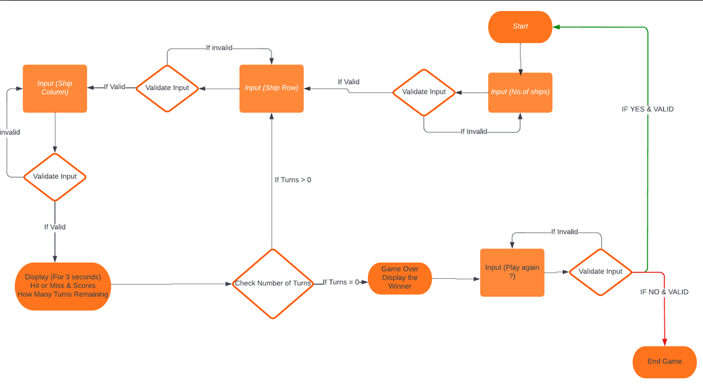

* [Back to contents](#table-of-contents)
*** 

## Features
### Start Game Screen:
#### The screen that appears at the start of the game.
 
* [Back to contents](#table-of-contents)
### Main Game Screen:
#### The screen that shows the main game area.
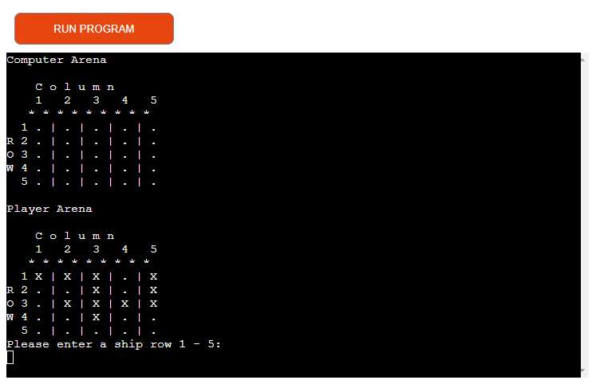 
* [Back to contents](#table-of-contents)
### Scoring Game Screen:
#### The screen that shows the scores & the turns left.
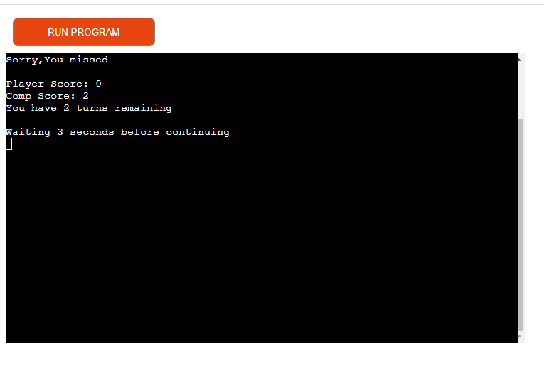 
* [Back to contents](#table-of-contents)
### Winner Game Screen:
#### The screen that that shows you have won the game.
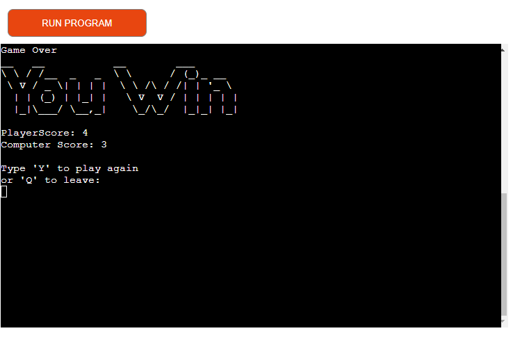 
* [Back to contents](#table-of-contents)
### Losers Game Screen:
#### The screen that that shows you have lost the game.
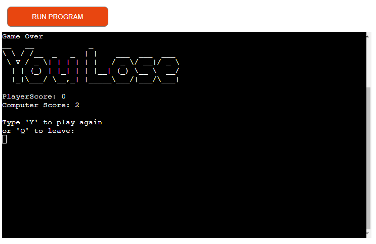 
* [Back to contents](#table-of-contents)
### Draw Game Screen:
#### The screen that appears that you have drawn with the computer.
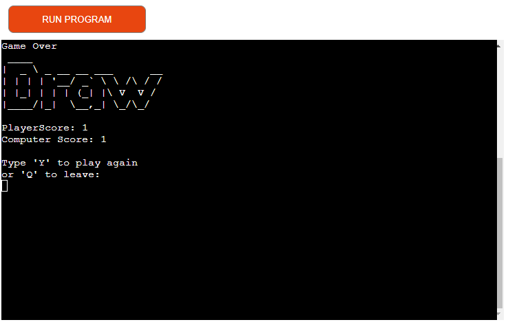 
* [Back to contents](#table-of-contents)
***

## Validation
## Validation for number of ships input:
### The screen that appears if wrong number is input.
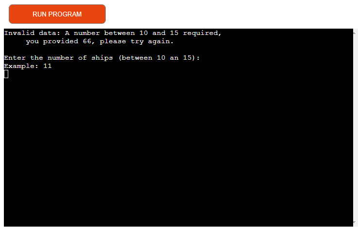 
* [Back to contents](#table-of-contents)
### The screen that appears if wrong character is input.
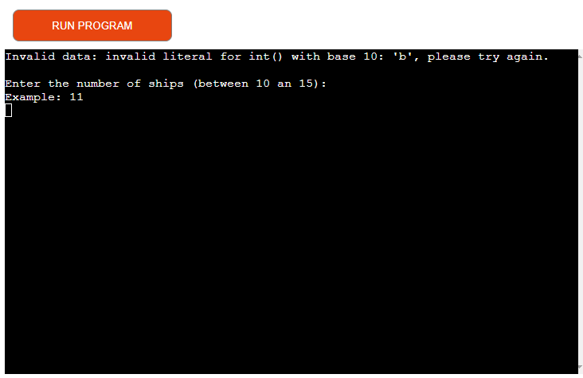 
* [Back to contents](#table-of-contents)
## Validation for player input to locate ships:
### The screen that appears if wrong row input is entered.
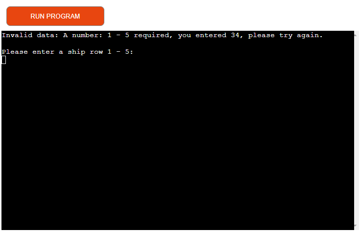 
* [Back to contents](#table-of-contents)
### The screen that appears if wrong column input is entered.
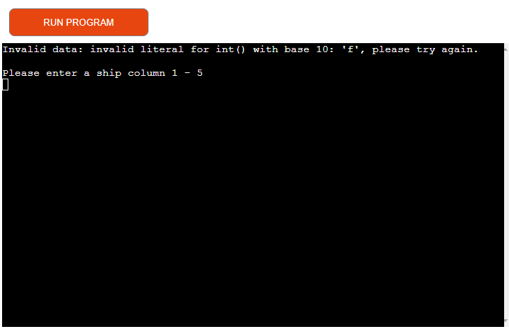 
* [Back to contents](#table-of-contents)
## Validation for player to decide to play again or not:
### The screen that appears if wrong play again input is entered.
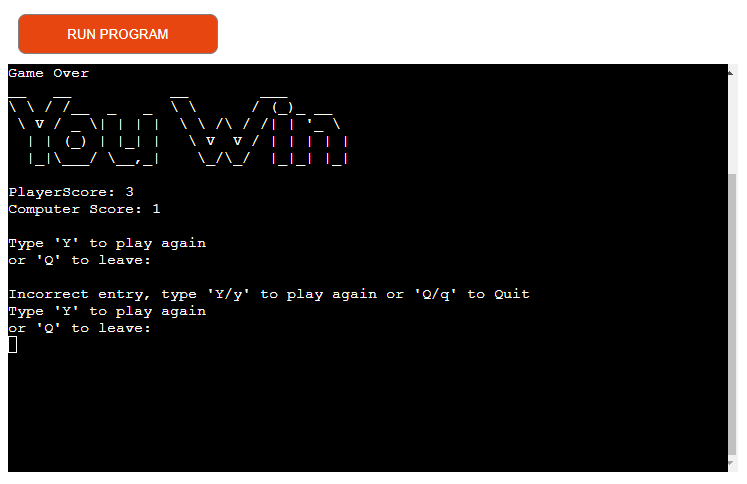 
* [Back to contents](#table-of-contents)
***

## Libraries and Modules Used
### 1. OS Module: Provides functions for interacting with the operating system
### In this program it is used to create a clear function.
### 2. SYS module: In this program it gives the ability to read the strings
### for the ACCII graphics/animation.
### 3. TIME module: This module enables the function 'print_slow' to have a time delay
### whilst it prints each letter.
### 4. RANDOM module: This module allows for the use of producing random results.
### 5. 'battleship_art.py: This file contains the module 'pyfiglet'.
### This allows for the creation of different texts and font sizes
### In this program it enables the creation of the game results and a logo.
* [Back to contents](#table-of-contents)
***

## Technologies:

* Gitpod
  * Provides a Theia IDE using VS Code as editor.
* Python
  * The programming language used in this app.
* Github
* LucidCharts
  * The flow charts were compiled using lucid charts.
* Heroka
  * The app was deployed onto the Heroku platform.
* Am I Responsive.
  * This site was used to show the responsive state of the app.

## Deployment

1. Create a list of dependencies for Heroku to use in the requirements.txt file. 
To create: type 'pip3 freeze > requirements.txt', then commit and push to Github.
2. Log into Heroku account.
3. Click on the 'Create new app' button.
4. Give the app a unique name and choose your region.
5. Goto 'Settings' and then 'Config Vars'. As this app has no sensitive data
you only need to make 1 addition. (Key = PORT, VALUE = 8000)
6. Goto buildpacks and add PYTHON, then NODEJS, in that order.
7. Goto deployment section, choose Github and confirm.
8. In the search area type your app name, when found confirm.
9. Choose 'Enable Automatic Deploy'
(This allows Heroku to rebuild the app after every ammendment)
10. Click deploy to make app and then click 'view'
* [Back to contents](#table-of-contents)
***

## Future Features
  * To enable the user to have different size ships.
  * To enable the ships to be horizontal or vertical.
  * To enable a 2 player game. (Not just againest the computer.) 
  ***

## Credits
  * ###  Code and Tutorials 
  * [Love Sandwiches](https://learn.codeinstitute.net/)
    * From the code structure to the deployment.. 
  * [Knowledge Mavens (Youtube)](https://www.youtube.com/watch?v=tF1WRCrd_HQ)
    * Mainly for the structure of the game area.   
     ***   
## Acknowledgements:
  * I would like to thank my mentor Ronan McClelland for his guidence throughout this project.
  * As this was my first Python project and, I would like to thank all in the Slack community who helped when I had many errors and pointed me in the right direction.
* [Back to contents](#table-of-contents)

