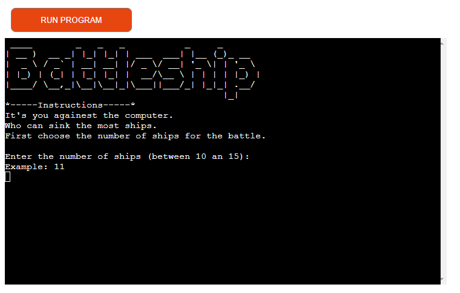

## [Table of Contents](#table-of-contents)
* [Purpose](#purpose)
* [Battlesphip Website](#battleship-website) 
* [User stories](#user-stories)
    * [First Time Visitor Goals](#first-time-visitor-goals)
    * [Returning Visitor Goals](#returning-visitor-goals)
* [Flowchart](#flowchart)   
* [Features](#features)    
* [Technologies](#technologies)
* [Testing](#testing)
  * [Manual Testing](#manual-testing)
  * [Bugs](#bugs)
* [Deployment](#deployment)
* [Credits](#credits)
   * [Code and Tutorials](#code-and-tutorials)
* [Acknoledgements](#acknowledgements)   
    
# BATTLESHIP GAME
## PURPOSE:
### GOAL and TARGET AUDIENCE:
#### To produce a game that will provide the user with the oppotunity to show their competitive instinticts whilst not actually having to compete agaienst another individual.
#### This is primarily a game of chance but also skill for after time you may be able to predict your opponents choice.
#### This is a game of chance, the player againest the computer.

* [Back to contents](#table-of-contents)

The live website can be found [here](https://project3-python-battleship.herokuapp.com/).

## Battleship Website

* [Back to contents](#table-of-contents)
*** 

## User stories

#### First Time Visitor Goals
* As a First Time user, I want to easily understand the main purpose of the site.
* As a first time user, I want to be able to play the game and participate in the experience.
* As a First Time user, I want to view the website and content clearly on my mobile device.
* As a first time user, I want to know when I have make an incorrect input.
#### Returning Visitor Goals
* As a Returning user, I want to be able to begin the game quickly.
* As a Frequent user, I want to check to see if there are any changes.

* [Back to contents](#table-of-contents)
***

## Flowchart

* [Back to contents](#table-of-contents)
*** 

## Features
### Start Game Screen:
#### The screen that appears at the start of the game.
 
### Main Game Screen:
#### The screen that shows the main game area.
 
### Scoring Game Screen:
#### The screen that shows the scores & the turns left.
 

### Winner Game Screen:
#### The screen that that shows you have won the game.
 
### Losers Game Screen:
#### The screen that that shows you have lost the game.
 
### Draw Game Screen:
#### The screen that appears that you have drawn with the computer.
 
***

## Validation
## Validation for number of ships input:
### The screen that appears if wrong number is input.
 
### The screen that appears if wrong character is input.
 
## Validation for player input to locate ships:
### The screen that appears if wrong row input is entered.
 
### The screen that appears if wrong column input is entered.
 
## Validation for player to decide to play again or not:
### The screen that appears if wrong play again input is entered.
 